# Naviamp

Naviamp is a music player for people who run their own music library. It connects to Navidrome and OpenSubsonic-compatible servers, then gives that library a polished app experience on desktop and Android.

The goal is simple: keep your music on your server, but make browsing, playback, discovery, lyrics, radio, playlists, and visualizers feel like they belong in a modern native player.

<p align="center">
  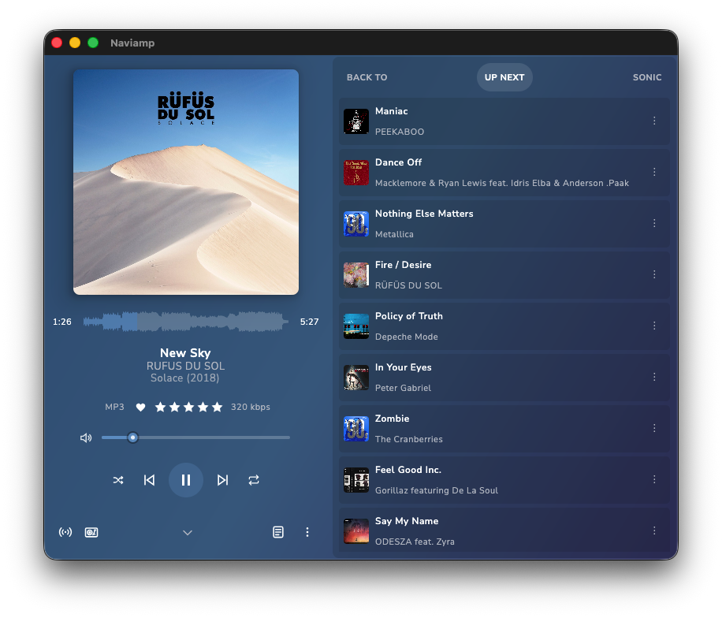
</p>

## Highlights

- Browse albums, artists, tracks, playlists, genres, favorites, recently added music, recently played music, and random library picks, with separate navigation for every credited track artist.
- Play from a focused Now Playing screen with queue controls, waveforms, ratings, favorites, lyrics, volume, repeat, shuffle, and track details close at hand.
- Build smarter listening sessions with Sonic Analysis, Sonic Mix, Sonic Path, sonic-backed track radio, sonic autoplay, and related-track queues when your server supports it.
- Create and edit smart playlists, then save generated sonic results and normal track selections back to your server.
- Use internet radio alongside your library, including station browsing, playback, and now-playing metadata.
- Customize the player with Aurora gradients, adjustable blurred album art, a selected solid color, album-art-driven accents, waveform display, compact layouts, display toggles, and desktop visualizers.
- Tune playback with ReplayGain, gapless playback, crossfade, sample-rate converter quality, and sample-rate matching.
- Follow along with embedded or downloaded lyrics, including synced lyric highlighting where available.
- Keep the same app model across macOS, Windows, Linux, and Android, with shared UI and playback behavior wherever the platforms allow it.

## Sonic Analysis and Discovery

Naviamp can use server-side sonic similarity data to turn a large library into something easier to explore. When connected to a compatible Navidrome/OpenSubsonic server with sonic support enabled, Naviamp can build queues from how songs sound, not only from tags or album metadata.

Sonic-powered features include:

- Sonic Mix: start with multiple seed tracks and build a cohesive queue around them.
- Sonic Path: choose a starting track and destination track, then generate a musical path between them.
- Track Radio: use sonic similarity as the preferred radio engine when available.
- Related tracks: show sonic-backed recommendations in the player queue area.
- Sonic autoplay: keep playback going with similar tracks when the current queue ends.
- Playlist saving: save generated sonic results as regular playlists for later listening.

If sonic support is not available from the server, Naviamp hides or falls back from those features instead of showing broken controls.

## Smart Playlists

Naviamp includes smart playlist support for building reusable listening rules rather than only static track lists. Smart playlists are useful for views like recent additions, favorites, genres, deep cuts, or other library slices that should update over time.

The player also keeps playlist workflows close to where listening happens:

- Add tracks, albums, artists, search results, downloads, and generated results to playlists.
- Create a new playlist from add-to-playlist dialogs.
- Save sonic-generated queues as playlists.
- Browse and play server playlists from the main library and Android Auto.
- Preserve playlist actions across desktop and Android where supported.

## Screenshots

<table>
  <tr>
    <td>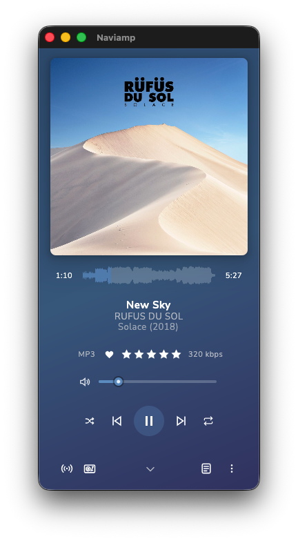</td>
    <td>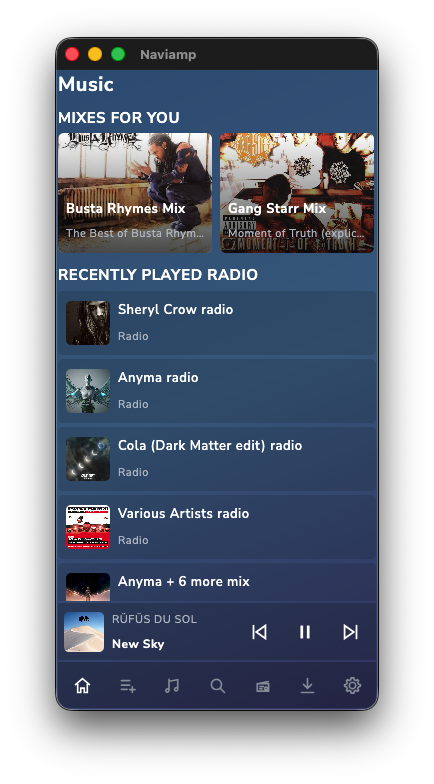</td>
    <td>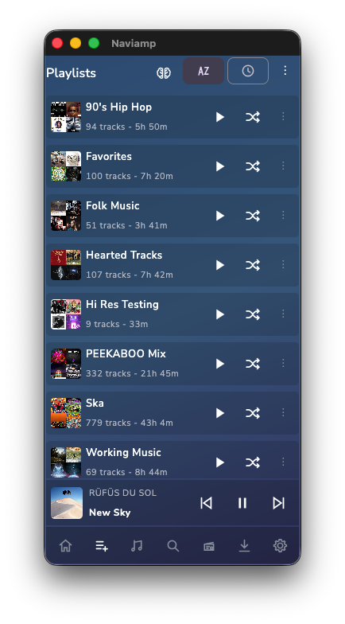</td>
  </tr>
  <tr>
    <td>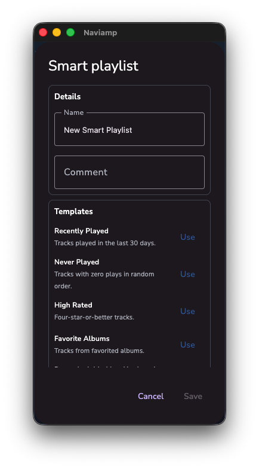</td>
    <td>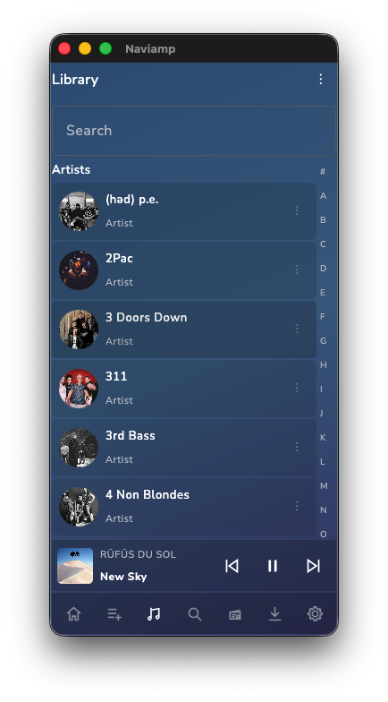</td>
    <td>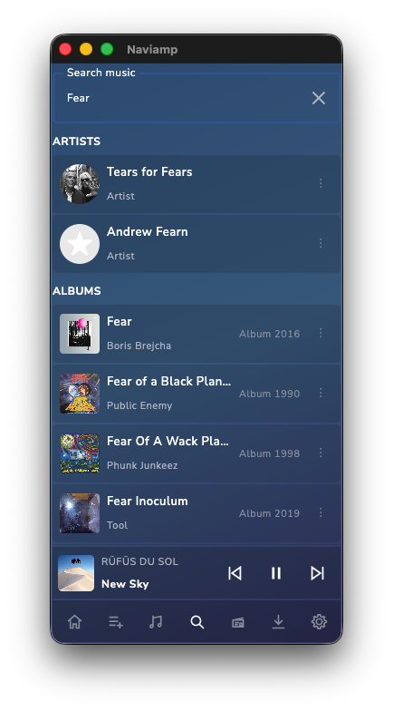</td>
  </tr>
  <tr>
    <td>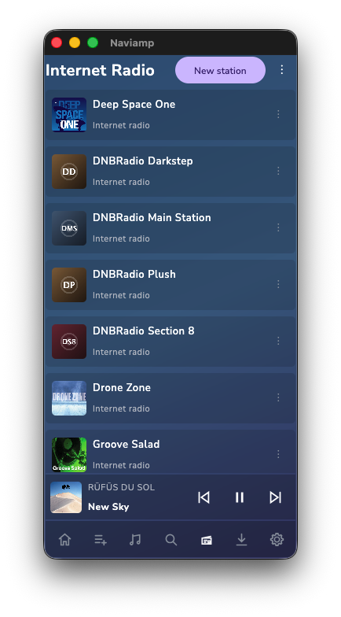</td>
    <td>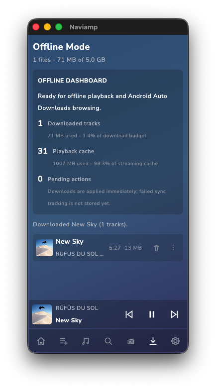</td>
    <td>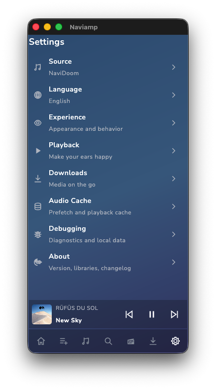</td>
  </tr>
  <tr>
    <td>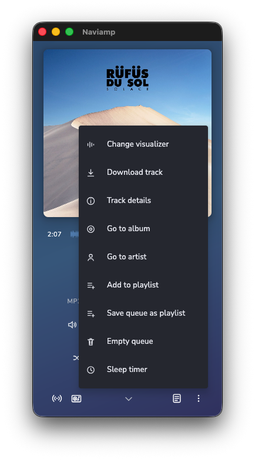</td>
    <td>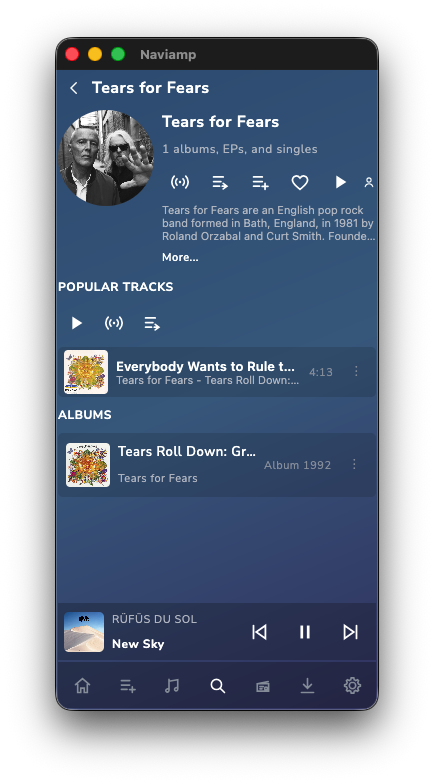</td>
    <td>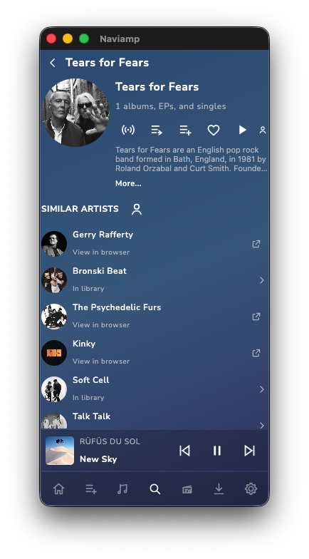</td>
  </tr>
</table>

## Playback

Naviamp uses the BASS audio engine for playback. The player is designed around fast queue changes, clear transport controls, and a Now Playing screen that can stay compact without hiding the important details.

Playback features include:

- Back To, Up Next, and Related queue views.
- Shuffle, repeat, seek, previous, next, and volume controls.
- ReplayGain support.
- Gapless playback and configurable crossfade.
- Sample-rate converter quality settings.
- Sample-rate matching for users who want the output device to follow the current track where the platform allows it.
- Waveform-based seeking.
- Configurable Now Playing metadata, including album year, bitrate info, volume bar, and long-text scrolling.
- Individually clickable artist credits, including multi-artist tracks and compatible legacy display credits.
- A compact desktop layout that moves volume below transport controls and hides it when vertical space is constrained.

## Visualizers

The desktop app includes GPU-backed visualizers that react to the playing track and use album-art-derived colors. Visualizers can be selected from the player and remembered between launches.

Current visualizer styles include reactive bars, fluid gradients, audio sphere, audio tunnel, ribbon trail, spectral ridge, mountains, frequency terrain, particle field, particle galaxy, wave interference, vinyl groove, and album art.

## Platforms

Naviamp currently targets:

- macOS
- Windows
- Linux
- Android

The desktop app is built with Compose Multiplatform. The Android app shares the same core domain and UI model where practical, so features can move across platforms without being rebuilt from scratch.

## Requirements

To use Naviamp, you need:

- A Navidrome server or another compatible OpenSubsonic server.
- A user account on that server.
- Sonic similarity support on the server if you want Sonic Mix, Sonic Path, and sonic-backed recommendations.

Navidrome is the first-class server target for Naviamp.

## Building from Source

Naviamp uses Kotlin Multiplatform, Compose Multiplatform, Gradle, SQLDelight, and native BASS integration.

Basic requirements:

- JDK 17 or newer.
- Android Studio or Android SDK if building Android.
- Platform-specific packaging tools if building installers.

Clone the project and use the checked-in Gradle wrapper:

```shell
git clone https://github.com/goosepod/naviamp.git
cd naviamp
./gradlew check
```

Common development commands are exposed through `make`:

```shell
make help
make desktop-test
make macos-test
make android-debug
```

Useful build targets:

- `make macos-test` builds, stages, and opens a local macOS app at `build/local-test/Naviamp.app`.
- `make macos-standalone` creates a macOS release zip under `apps/desktop/build/compose/distributions`.
- `make android-debug` builds the Android debug APK.
- `make desktop-test` runs the desktop test task.
- `make linux-test` builds and stages a Linux desktop app when run on Linux with the required native playback resources.

Windows and Linux installer targets must run on their target operating system because `jpackage` packages for the current OS:

```shell
make windows-standalone
make windows-installer
make linux-standalone
make linux-installer
```

Android release builds require a local signing configuration. Use `.env.android-signing.example` as the template for the required signing values.

## Project Layout

```text
apps/
  android/        Android app target
  desktop/        Compose Multiplatform desktop app
core/
  domain/         Shared models, playback, queues, settings, and provider contracts
  storage/        Shared SQLDelight storage
  ui/             Shared Compose UI and platform UI seams
providers/
  navidrome/      Navidrome and OpenSubsonic provider implementation
native/           Native playback and visualizer support code
readme-assets/    Images used by this README
```

## License

Naviamp is licensed under the GNU General Public License v3.0. See [LICENSE](LICENSE) for the full license text.
