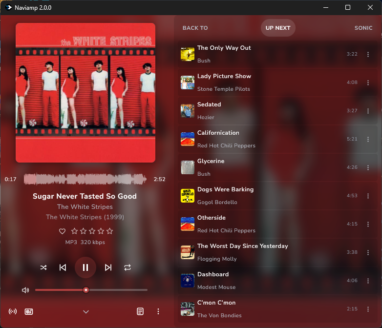
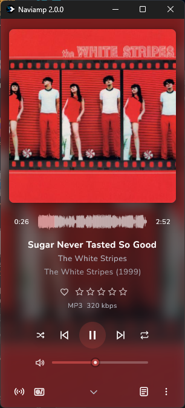
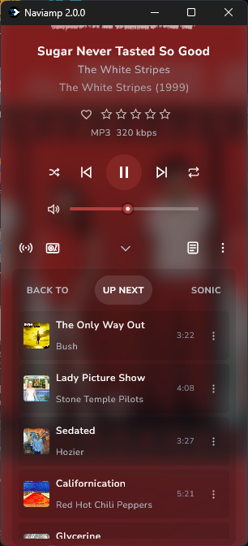
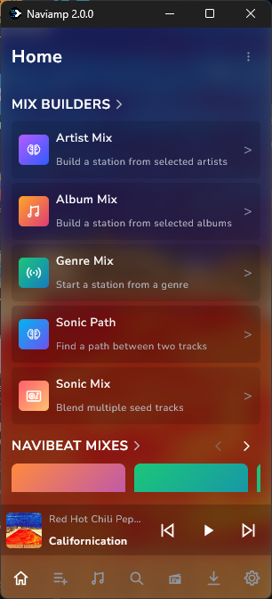
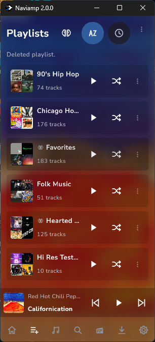
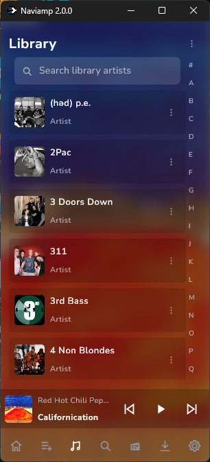
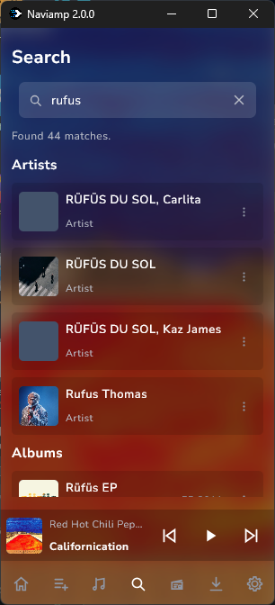
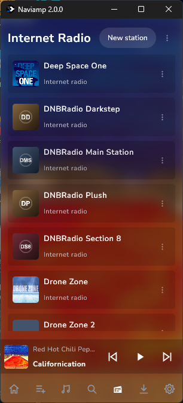
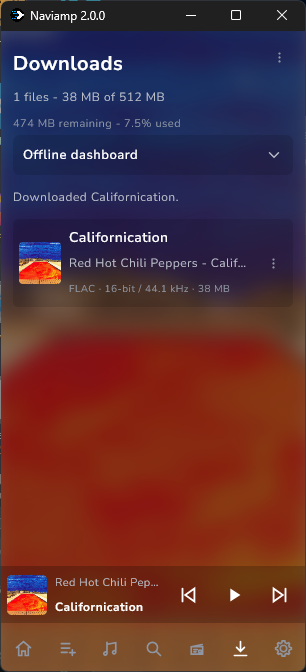
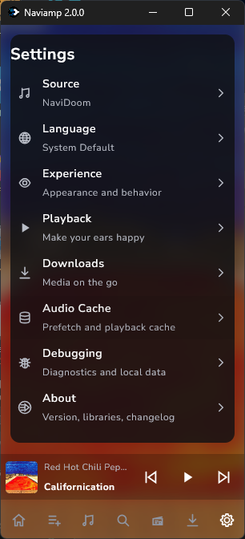

<p align="center">
  
</p>

# Naviamp

Naviamp is a modern music player for the libraries you already own and the services you already
use. Connect Navidrome, another Subsonic/OpenSubsonic server, Jellyfin, or your Bandcamp collection,
then browse, discover, queue, download, and play from one polished app on desktop, Android, and iOS.

Your music stays with the server you choose. Naviamp brings the player.

<p align="center">
  
</p>

## The big hitters

- **A real library experience.** Browse albums, artists, tracks, genres, favorites, recently added
  and recently played music, random picks, and every credited artist on a track.
- **Powerful discovery.** Build Artist, Album, and Genre mixes; use Sonic Mix and Sonic Path; start
  track radio; explore related music; and let sonic autoplay keep the queue moving when the server
  supports similarity data.
- **Playlists that go further.** Create and edit regular playlists, add music from throughout the
  app, save generated queues, and build reusable smart playlists on compatible servers.
- **A full Now Playing experience.** Manage Back To, Up Next, and related queues alongside waveform
  seeking, favorites, ratings, lyrics, repeat, shuffle, volume, and detailed audio metadata.
- **Internet radio.** Browse, create, edit, and play internet radio stations next to the rest of your
  music, with live now-playing metadata when the station provides it.
- **Downloads and offline listening.** Keep music on the device, choose storage and cache behavior,
  and use an offline dashboard when the server is out of reach.
- **Serious playback controls.** ReplayGain, gapless playback, crossfade, sample-rate matching,
  configurable resampling quality, album and playlist playback profiles, and native BASS playback
  are built in.
- **Make it yours.** Album-art colors, Aurora gradients, blur and solid-color treatments, compact
  layouts, configurable metadata, waveforms, and a large collection of reactive desktop
  visualizers are all available.
- **One app across devices.** Naviamp targets macOS, Windows, Linux, Android, and iOS with shared
  product behavior, secure credential storage, settings sync, and Android Auto support.

## Supported music services

| Service | What Naviamp brings |
| --- | --- |
| **Navidrome** | The fullest experience, including native authentication, smart playlists, ratings, favorites, rich OpenSubsonic features, and sonic discovery when enabled on the server. |
| **Subsonic and OpenSubsonic** | Connect compatible self-hosted servers through the standard protocol. Naviamp detects advertised capabilities and shows only the features the server can provide. |
| **Jellyfin** | Connect directly to Jellyfin music libraries for browsing, search, playback, downloads, playlists, lyrics, and favorites. |
| **Bandcamp** | Play and download your collection through Bandcamp's Subsonic beta using credentials generated in Fan Settings. Playlist support follows the capabilities of the beta service. |

Provider capabilities differ. Naviamp gracefully hides or falls back from server-specific features
instead of leaving non-working controls on screen. Sonic features require a server that advertises
compatible similarity support, and smart-playlist editing remains provider-specific.

## Screenshots

<table>
  <tr>
    <td></td>
    <td></td>
    <td></td>
  </tr>
  <tr>
    <td></td>
    <td></td>
    <td></td>
  </tr>
  <tr>
    <td></td>
    <td></td>
    <td></td>
  </tr>
</table>

## Discovery and playlists

Naviamp can turn a large library into a listening session without making you manually assemble
every queue. Artist, Album, and Genre Mix work broadly; servers with sonic similarity support also
unlock Sonic Mix, Sonic Path, related tracks, track radio, and sonic autoplay. Generated results can
be edited in the queue or saved as a normal playlist.

Genre Mix can organize the genre tags found on your server into a library-specific MusicBrainz
hierarchy. Expand a broad genre to browse its subgenres, or select the parent to include every
matching descendant in one mix. Tags that do not map cleanly stay visible, and smaller or sparsely
matched libraries retain the complete flat browser.

Regular playlist workflows live wherever you are browsing: add tracks, albums, artists, search
results, downloads, and generated mixes; create a playlist without leaving the picker; reorder and
remove tracks; or start a playlist in order or shuffled. Compatible servers can also expose smart
playlists whose rules keep the contents fresh over time. Navidrome smart playlists include
genre-aware suggestions and can preview supported rules against the synced library before saving.

## Playback and presentation

Naviamp uses the BASS audio engine and combines its playback controls with a flexible shared UI:

- Back To, Up Next, and Related queue views with queue editing.
- Waveform seeking, synced and unsynced lyrics, favorite and rating actions, and clickable artist
  credits.
- ReplayGain, gapless playback, crossfade, sample-rate matching, and resampler quality controls.
- Per-album and per-playlist playback profiles for transition and ReplayGain overrides.
- Configurable artwork, colors, gradients, blur, metadata, long-text behavior, and compact layouts.
- Desktop visualizers ranging from reactive bars and fluid gradients to particles, terrain, tunnels,
  vinyl grooves, and album art.
- Internet-radio playback and metadata alongside normal library playback.
- Download, cache, and offline controls for listening away from the server.

## Platforms and downloads

Naviamp 2.3 is available for macOS, Windows, Linux, and Android. An unsigned arm64 iPhone/iPad IPA
preview is also available for users who can provide their own signing.

Download current packages from [GitHub Releases](https://github.com/goosepod/naviamp/releases).
Windows and macOS desktop packages are not publisher-signed and may show an operating-system
warning. Windows installers install only for the current user and do not require administrator
permission. See the [Naviamp 2.3 release notes](docs/v2.3-release-notes.md) for upgrade details and
[Sideloading Naviamp on iPhone or iPad](docs/ios-sideloading.md) for the iOS preview.

If an older machine-wide Windows release is already installed, uninstall that copy once before
using the current-user installer. Removing the old copy may require administrator permission; new
installations and subsequent upgrades do not.

### Opening Naviamp on macOS

Only bypass the macOS warning for a Naviamp package downloaded from the official GitHub Releases
page above. Move `Naviamp.app` into Applications, then try to open it once. Open **System Settings →
Privacy & Security**, scroll to **Security**, and click **Open Anyway** for Naviamp.

Experienced users can instead remove the quarantine marker for this app only and open it from
Terminal:

```shell
xattr -dr com.apple.quarantine "/Applications/Naviamp.app"
open "/Applications/Naviamp.app"
```

These commands intentionally bypass Gatekeeper for this copy of Naviamp. They do not disable
Gatekeeper system-wide and do not require `sudo`.

## Building from source

Naviamp uses Kotlin Multiplatform, Compose Multiplatform, Gradle, SQLDelight, and native BASS
integration. You will need JDK 17 or newer, plus the Android SDK or platform packaging tools for the
targets you want to build.

```shell
git clone https://github.com/goosepod/naviamp.git
cd naviamp
./gradlew check
```

Common development commands are exposed through `make`:

```shell
make help
make test
make desktop-test
make macos-test
make android-debug
```

- `make test` runs the complete local non-device gate, including architecture checks, migrations,
  shared/provider/platform tests, native playback verification, and aggregate coverage.
- `make coverage` verifies the aggregate coverage floor and writes a browsable report.
- `make macos-test` builds, stages, and opens a local macOS app.
- `make android-debug` builds the Android debug APK.
- Windows and Linux standalone/installer targets must run on their respective operating systems.

The complete test matrix is documented in [Testing Naviamp](docs/testing.md). The shared
architecture and platform boundaries are documented in the
[Naviamp 2.0 cross-platform plan](docs/v2-cross-platform-plan.md).

## Project layout

```text
apps/             Thin Android, Desktop, and iOS application hosts
core/domain/      Shared models, playback, discovery, settings, and provider contracts
core/storage/     Shared SQLDelight persistence and migrations
core/ui/          Shared Compose UI and platform UI seams
providers/        Navidrome/OpenSubsonic and Jellyfin provider implementations
platforms/        Narrow operating-system and native playback adapters
native/           Native BASS playback and visualizer support
readme-assets/    Images used by this README
```

## License

Naviamp is licensed under the GNU General Public License v3.0, with additional permission to link
and distribute the application with BASS. See [LICENSE](LICENSE), the
[BASS linking exception](BASS-LINKING-EXCEPTION.md), and
[third-party notices](THIRD_PARTY_NOTICES.md).

BASS and its add-ons are separately licensed. Naviamp currently uses BASS under its free
non-commercial terms; commercial use requires the appropriate BASS license for every supported
platform.
